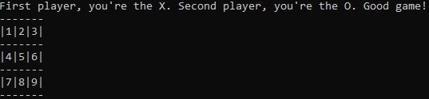

# The repository

This repository is dedicated to a graded activity in the subject `Special Topics in Management Information Systems G (IMD 0246 - TÓPICOS ESPECIAIS EM SISTEMAS DE INFORMAÇÃO DE GESTÃO G)`. The language used here is Rust.

# Requirements
- To compile and execute this application, the user must have installed rustc and cargo.
- For further information on how to install: https://www.rust-lang.org/tools/install

# Compiling and executing
- In terminal, on project's folder, insert the command `cargo run`. After this, the program will compile and execute.

# How to play

- The game will start showing the following image:

- The players will input a number between 1 and 9 according to the wanted position.

- Good game!

---

> Developed by Renzo Zukeram